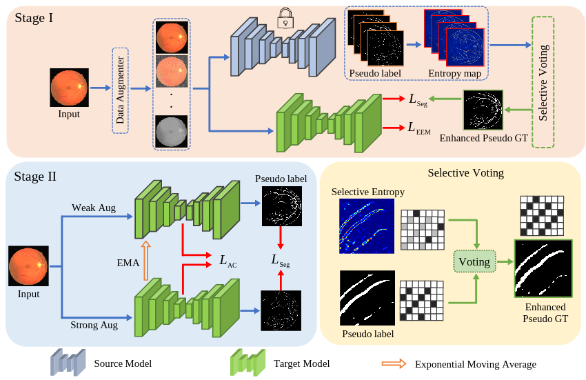

# On-the-Fly Adaptation

Official Pytorch Code base for [Target and Task specific Source-Free Domain Adaptive Image Segmentation]()

[Paper]() | [Project page]()

## Introduction

Solving the domain shift problem during inference is essential in medical imaging as most deep-learning based solutions suffer from it. In practice, domain shifts are tackled by performing Unsupervised Domain Adaptation (UDA), where a model is adapted to an unlabeled target domain by leveraging the labelled source domain. In medical scenarios, the data comes with huge privacy concerns making it difficult to apply standard UDA techniques. Hence, a closer clinical setting is Source-Free UDA (SFUDA), where we have access to source trained model but not the source data during adaptation. Methods trying to solve SFUDA typically address the domain shift using pseudo-label based self-training techniques. However due to domain shift, these pseudo-labels are usually of high entropy and denoising them still does not make them perfect labels to supervise the model. Therefore, adapting the source model with noisy pseudo labels reduces its segmentation capability while addressing the domain shift. To this end, we propose a two-stage approach for source-free domain adaptive image segmentation: 1) Target-specific adaptation followed by 2) Task-specific adaptation. In the first stage, we focus on generating target-specific pseudo labels while suppressing high entropy regions by proposing an Ensemble Entropy Minimization loss. We also introduce a  selective voting strategy to enhance pseudo-label generation. In the second stage, we focus on adapting the network for task-specific representation by using a teacher-student self-training approach based on augmentation-guided consistency. We evaluate our proposed method on both 2D fundus datasets and 3D MRI volumes across 7 different domain shifts where we achieve better performance than recent UDA and SF-UDA methods for medical image segmentation.


<p align="center">
  
</p>


## Using the code:

The code is stable while using Python 3.6.13, CUDA >=10.1

- Clone this repository:
```bash
git clone https://github.com/Vibashan/tt-sfuda
cd tt-sfuda/
```

To install all the dependencies using conda:

```bash
conda env create -f environment.yml
conda activate tt_sfuda
```


## 2D Datasets
1) Download using this [Link](https://blogs.kingston.ac.uk/retinal/chasedb1/).

Make sure the datasets are arranged in the following structure:

```
TT_SFUDA_2d/inputs
└── <dataset name>
    ├── images
    |   ├── 001.png
    │   ├── 002.png
    │   ├── 003.png
    │   ├── ...
    |
    └── masks
        ├── 0
        |   ├── 001.png
        |   ├── 002.png
        |   ├── 003.png
        |   ├── ...
 
```


## 3D Datasets
4) BraTS 2019 - [Link](https://www.med.upenn.edu/cbica/brats2019/data.html)

```
TT_SFUDA_3d/data
├── train
|    ├── all
|    |   ├── BraTS19_2013_0_1
|    │   ├── BraTS19_2013_1_1
|    │   ├── ...
|    |
|    |── HGG
|    |   ├── ...
|    |
|    |── LGG   
|        ├── ...
├── val
    ├── BraTS19_CBICA_AAM_1
    ├── BraTS19_CBICA_ABT_1
    ├── ...
```


## Source-trained Model Weights

Download the source-trained model weights for 2D into TT_SFUDA_2D [Link](https://drive.google.com/drive/folders/1_8gMlFQHlzpEQyzviET4UzRRDiURWbjk?usp=sharing)

Download the source-trained model weights for 3D into TT_SFUDA_3D [Link](https://drive.google.com/drive/folders/1_8gMlFQHlzpEQyzviET4UzRRDiURWbjk?usp=sharing)

## Training and Validation

For 2D and 3D SFUDA experiments, please follow the steps mentioned in TT_SFUDA_2D and TT_SFUDA_3D README.md.

### Acknowledgements:

This code-base uses certain code-blocks and helper functions from [UNet++](https://github.com/4uiiurz1/pytorch-nested-unet).

### Citation: